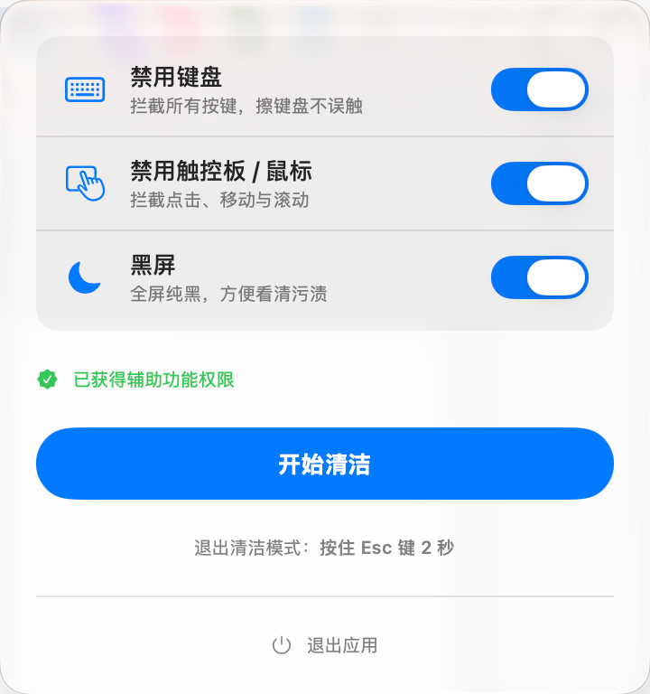

# CleanMyMacBook



一个 macOS 菜单栏小工具，帮助你在擦拭 MacBook 时**禁用键盘、触控板和屏幕**，避免误触的同时看清污渍。

## 功能

| 功能 | 说明 |
|------|------|
| 🧹 禁用键盘 | 拦截所有按键，放心擦键盘 |
| 🖱️ 禁用触控板 / 鼠标 | 拦截点击、移动与滚动 |
| 🌑 黑屏 | 全屏纯黑，灰尘污渍一目了然 |
| ⏎ 退出清洁模式 | 按住 `Esc` 键 2 秒即可恢复 |

## 系统要求

- macOS 13.0 (Ventura) 或更高版本
- Apple Silicon / Intel 通用

## 安装

### 方式一：下载 DMG

前往 [Releases](https://github.com/luoguang/CleanMyMacBook/releases) 页面下载最新的 `CleanMyMacBook.dmg`，拖入 Applications 文件夹即可。

### 方式二：自行构建

```bash
git clone https://github.com/luoguang/CleanMyMacBook.git
cd CleanMyMacBook
./build_dmg.sh
```

构建产物 `CleanMyMacBook.dmg` 会自动弹出到 Finder。

## 权限说明

本应用需要 macOS「辅助功能」权限（Accessibility）来拦截键盘和触控板输入。首次点击「开始清洁」时会弹出授权请求，授权后即可使用。

> 不会收集、上传或传输任何用户数据。

## 项目结构

```
CleanMyMacBook/
├── CleanMyMacBook.xcodeproj/   # Xcode 项目
├── CleanMyMacBook/
│   ├── CleanMyMacBookApp.swift # 应用入口 (MenuBarExtra)
│   ├── ContentView.swift       # UI 主界面
│   ├── CleaningController.swift # 清洁逻辑控制
│   └── Assets.xcassets/        # 资源文件
├── build_dmg.sh                # 本地构建 DMG 脚本
└── .github/workflows/build.yml # GitHub Actions 自动打包
```

## License

MIT
